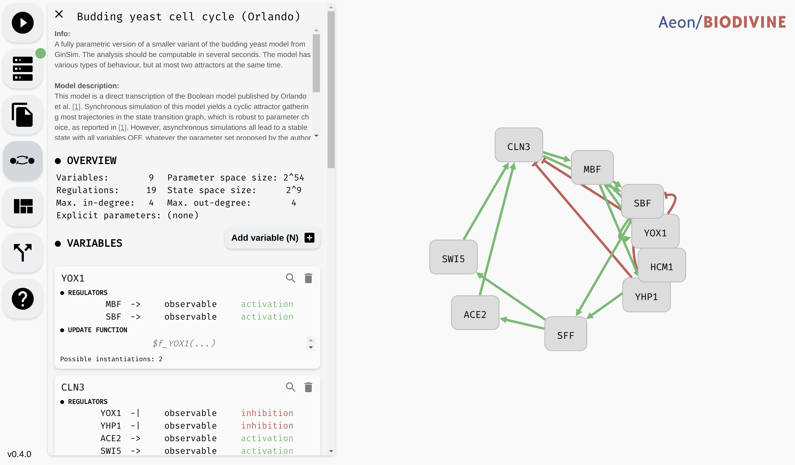

# Model Editor

In this chapter, we discuss how to create, import, modify, and export Boolean networks, as well as how to enhance them with logical parameters. If you only want to work with existing Boolean networks (available as `.sbml` or `.aeon` file), i.e. you are not planning to edit the network, just import it, you can skip to the last section of this chapter.

AEON model editing functionality is distributed between two main editor "components": an interactive *regulatory graph editor*, and a *model panel*. The regulatory graph editor is the main area of the AEON window, while the model editor can be opened by clicking the `Model Editor` button in the left menu.

*Model panel (left) and regulatory graph editor (right)*

We first focus on the regulatory graph editor, and show how to manipulate network variables and regulations. Then, we shift our focus to the model panel and show how to edit network update functions or add parameters. Finally, we look at structural properties of regulatory graphs and how AEON verifies these properties on-the-fly. At the end of the chapter, we discuss model formats supported by AEON.  