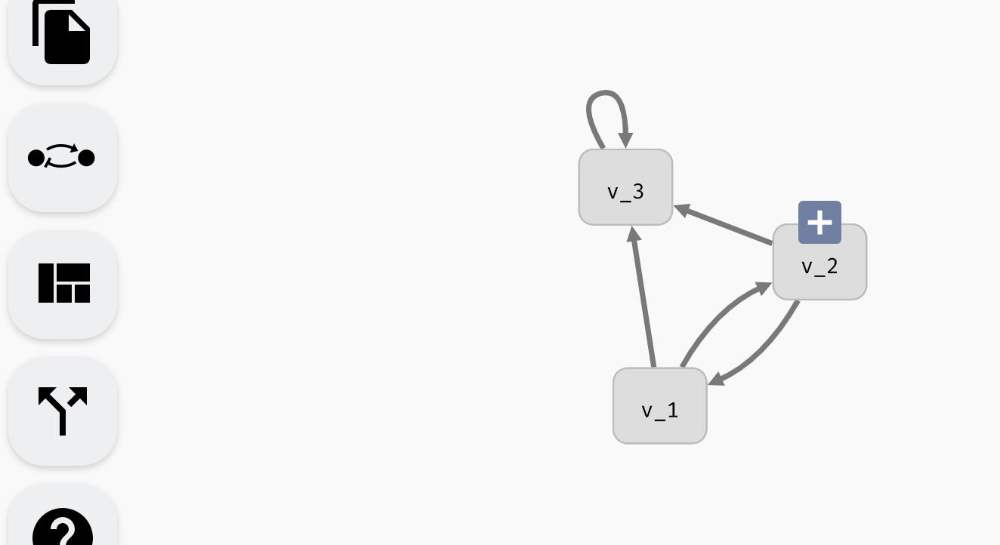

## Variables and regulations

To create a new variable, double-click anywhere in the empty space of the AEON window. A new *variable node* will appear at that location (You can also press **N** to create a new variable node at a default location). A variable node in a regulatory graph represents one variable of a Boolean network. When you move the cursor over this variable node, a blue **+** icon appears. By dragging from this icon to some variable node, you can create *regulations*, i.e. edges of the regulatory graph. Note that self-loops (*auto-regulations*) are also supported. A regulation edge from `A` to `B` represents a (possible) dependence of `B` on `A`. 

*Creating variables and regulations in the regulatory graph.*

You can click and drag variable nodes to re-arrange them however you like. To help with arranging large networks, AEON contains an auto-layout algorithm that you can activate using the `Apply Layout` button in the left menu.

*Auto-layout functionality.*

Finally, each variable node or regulation edge can be selected by clicking. This opens a *variable* or *regulation menu*. Through here, you can access additional options, such as removing a variable or regulation (which you can do using backspace as well). You can also *rename* a variable, which opens the *model panel* and focuses the edit field of the variable name. We will talk about the remaining options in edge and regulation menus in the following sections.  

*Deleting and editing regulatory graph elements.*